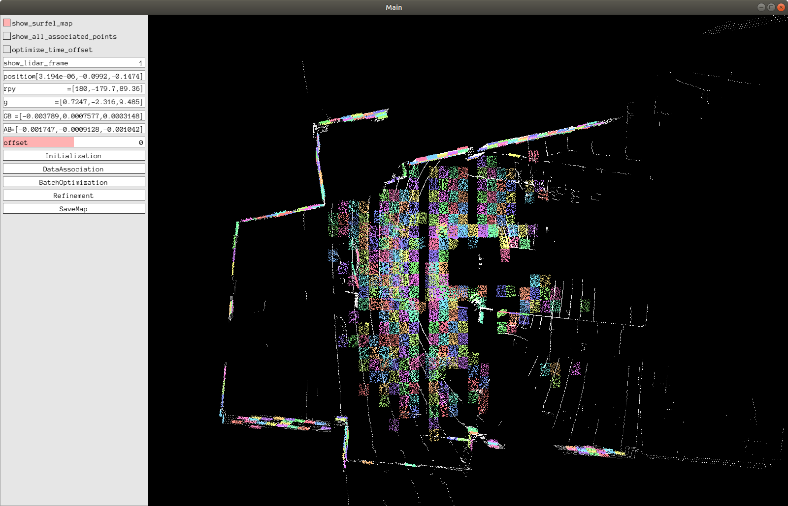
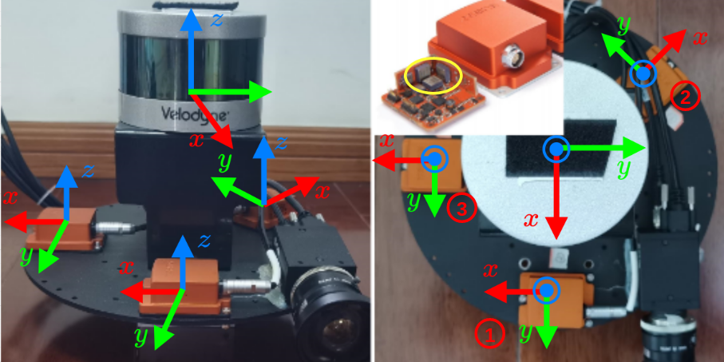

# LI-Calib

Ubuntu 20环境下使用浙大的    APRIL-ZJU/lidar_IMU_calib 。

**LI-Calib** is a toolkit for calibrating the 6DoF rigid transformation and the time offset between a 3D LiDAR and an IMU. It's based on continuous-time batch optimization. IMU-based cost and LiDAR point-to-surfel distance are minimized jointly, which renders the calibration problem well-constrained in general scenarios. 

## **Prerequisites**

- [ROS](http://wiki.ros.org/ROS/Installation) (tested with Kinetic and Melodic)

  ```shell
  sudo apt-get install ros-melodic-pcl-ros ros-melodic-velodyne-msgs
  ```

- [Ceres](http://ceres-solver.org/installation.html) (tested with version 1.14.0)  ==ceres 的版本必须是1.14==

- [Kontiki](https://github.com/APRIL-ZJU/Kontiki) (Continuous-Time Toolkit) ==Li-calib包中自带，不需要下载==
- Pangolin (for visualization and user interface) ==Li-calib包中自带，不需要下载==
- [ndt_omp](https://github.com/APRIL-ZJU/ndt_omp) ==Li-calib包自动下载不需要下载==

Note that **Kontiki** and **Pangolin** are included in the *thirdparty* folder.

## Install

### ceres 1.14安装

下载链接：https://github.com/ceres-solver/ceres-solver/releases/tag/1.14.0

下载后解压在主目录。

**安装ceres 1.14依赖项：**

` sudo apt-get install liblapack-dev libsuitesparse-dev libcxsparse3.1.2 libgflags-dev libgoogle-glog-dev libgtest-dev`

可能会出现无法定位libcxsoarse3.1.2的问题，解决方法：

```
//第一步，打开sources.list
sudo gedit /etc/apt/sources.list
//第二步，将下面的源粘贴到最上方sources.list
deb http://cz.archive.ubuntu.com/ubuntu trusty main universe 
//第三步，更新源
sudo apt-get update
//第四步，重新输入依赖项安装命令安装依赖项
sudo apt-get install liblapack-dev libsuitesparse-dev libcxsparse3.1.2 libgflags-dev libgoogle-glog-dev libgtest-dev
```

**编译**

```
cd ceres-solver-1.14.0
mkdir build
cd build
cmake ..
make
```

**安装**

`sudo make install`


###Li-calib安装

Clone the source code for the project and build it.

```shell
# init ROS workspace
# 建立工作空间
mkdir -p ~/catkin_li_calib/src
cd ~/catkin_li_calib/src
catkin_init_workspace

# Clone the source code for the project and build it. 
# 在github中下载源码
git clone https://github.com/JiaWenHa/Li-Calib

# ndt_omp
# 仍然是在src文件夹的终端中执行下列指令，下载ndt_omp
wstool init
wstool merge Li-Calib/depend_pack.rosinstall
wstool update

# Pangolin
# 安装Pangolin
cd Li-Calib
./build_submodules.sh

## build
# 编译
cd ../..
catkin_make
source ./devel/setup.bash
```

## Examples

Currently the LI-Calib toolkit only support `VLP-16` but it is easy to expanded for other LiDARs. 

Run the calibration:

```shell
./src/Li-Calib/calib.sh
```

The options in `calib.sh` the have the following meaning:

- `bag_path` path to the dataset.
- `imu_topic` IMU topic.
- `bag_start` the relative start time of the rosbag [s].
- `bag_durr`  the duration for data association [s].
- `scan4map` the duration for NDT mapping [s].
- `timeOffsetPadding` maximum range in which the timeoffset may change during estimation [s].
- `ndtResolution` resolution for NDT [m].



Following the step: 

1. `Initialization`

2. `DataAssociation`

   (The users are encouraged to toggle the `show_lidar_frame` for checking the odometry result. )

3. `BatchOptimization`

4. `Refinement`

6. `Refinement`

7. ...

8. (you cloud try to optimize the time offset by choose `optimize_time_offset` then run `Refinement`)

9. `SaveMap`

All the cache results are saved in the location of the dataset.

**Note that the toolkit is implemented with only one thread, it would  response slowly while processing data. Please be patient** 

## Dataset



Dataset for evaluating LI_Calib are available at [here](https://drive.google.com/drive/folders/1kYLVLMlwchBsjAoNqnrwq2N2Ow5na4VD?usp=sharing). 

We utilize an MCU (stm32f1) to simulate the synchronization Pulse Per Second (PPS) signal. The LiDAR's timestamps are synchronizing to UTC, and each IMU captures the rising edge of the PPS signal and outputs the latest data with a sync signal. Considering the jitter of the internal clock of MCU, the external synchronization method has some error (within a few microseconds).

Each rosbag contains 7 topics:

```
/imu1/data          : sensor_msgs/Imu           
/imu1/data_sync     : sensor_msgs/Imu           
/imu2/data          : sensor_msgs/Imu           
/imu2/data_sync     : sensor_msgs/Imu           
/imu3/data          : sensor_msgs/Imu           
/imu3/data_sync     : sensor_msgs/Imu           
/velodyne_packets   : velodyne_msgs/VelodyneScan
```

`/imu*/data`  are raw data and the timestamps are coincide with the received time. 

`/imu*/data_sync` are the sync data, so do `/velodyne_packets` .

## Credits 

This code was developed by the  [APRIL Lab](https://github.com/APRIL-ZJU) in Zhejiang University.

For researchers that have leveraged or compared to this work, please cite the following:

Jiajun Lv, Jinhong Xu, Kewei Hu, Yong Liu, Xingxing Zuo. Targetless Calibration of LiDAR-IMU System Based on Continuous-time Batch Estimation. IROS 2020.  [[arxiv](https://arxiv.org/pdf/2007.14759.pdf)]

## License

The code is provided under the [GNU General Public License v3 (GPL-3)](https://www.gnu.org/licenses/gpl-3.0.txt).

## 相比原代码的修改

1.src/ndt_omp CMakeLists.txt

```cmake
 -std=c++14
 PCL 1.10
```

2.src/lidar_IMU_calib/include/utils/dataset_reader.h

```c++
 bool read(const std::string pat...)  ->void read(const std::string pat...)
```

3.src/lidar_IMU_calib/thirdparty/Kontiki/include/kontiki/sensors/constant_bias_imu.h

```c++
 bool LockGyroscopeBias(bool lock) ->void LockGyroscopeBias(bool lock)
 bool LockAccelerometerBias(bool lock) -> void LockAccelerometerBias(bool lock)
```

## 本算法的使用方法

### 1. 数据录制

鉴于是基于NDT匹配算法的里程计计算， 数据录制需要注意：

1. 需要在平面多的房间里录制；

2. xyz轴方向都需要移动

3. 不要旋转过/移动过猛

```shell
rosbag -record -o out /velodyne_packets /你的IMU数据话题
查看数据：
rosrun nodelet nodelet standalone velodyne_pointcloud/CloudNodelet _calibration:="/home/XXX（your username）/catkin_velodyne（your velodyne catkin工作环境）/src/velodyne/velodyne_pointcloud/params/VLP16db.yaml"
然后播放bag包 rosbag play yourbagname.bag
在rviz中查看即可rosrun rviz rviz
```

### 2. 适配launch

修改licalib_gui.launch文件

注意此处的velodyne数据为velodyne_packets

```xml
<?xml version="1.0"?>
<launch>
    <arg name="topic_imu"           default="/你的imu数据话题" />
    <arg name="path_bag"            default="/home/$(env USER)/bag包位置" />
    <arg name="bag_start"           default="0" />
    <arg name="bag_durr"            default="48" />
    <arg name="scan4map"            default="15" />
    <arg name="lidar_model"         default="VLP_16" />
    <arg name="ndtResolution"       default="0.5" /> <!-- 0.5 for indoor case and 1.0 for outdoor case -->

    <arg name="time_offset_padding" default="0.015" />
    <arg name="show_ui"    default="true" />

    <node pkg="li_calib" type="li_calib_gui" name="li_calib_gui" output="screen">
    <!-- <node pkg="li_calib" type="li_calib_gui" name="li_calib_gui" output="screen" clear_params="true" launch-prefix="gdb -ex run &#45;&#45;args">-->

        <param name="topic_imu"         type="string"   value="$(arg topic_imu)" />
        <param name="topic_lidar"       type="string"   value="/velodyne_packets" />
        <param name="LidarModel"        type="string"   value="$(arg lidar_model)" />
        <param name="path_bag"          type="string"   value="$(arg path_bag)" />
        <param name="bag_start"         type="double"   value="$(arg bag_start)" />
        <param name="bag_durr"          type="double"   value="$(arg bag_durr)" /> <!-- for data association -->
        <param name="scan4map"          type="double"   value="$(arg scan4map)" />
        <param name="ndtResolution"     type="double"   value="$(arg ndtResolution)" />

        <param name="time_offset_padding"   type="double"   value="$(arg time_offset_padding)" />
        <param name="show_ui"               type="bool"     value="$(arg show_ui)" /><!-- 我们用ui界面来进行操作 -->
    </node>

</launch>

```

###3. 运行及相关问题

**运行：**

在UI界面依顺序点击：初始化(Initialization)->初始化(Initialization)...直到初始化成功（判定标准看问题1.）->数据关联(Data Association)->初始化优化（Batch  Optimization）->迭代优化（Refinement）->迭代优化（Refinement）...直至数据不再变换

####3.1 数据跑飞问题

如果你录取的数据，不是在平面多的房间里或者旋转过大，极有可能出现数据跑飞的问题，表现就是XYZ偏差超出正常值，这时候需要重录数据。

## 
